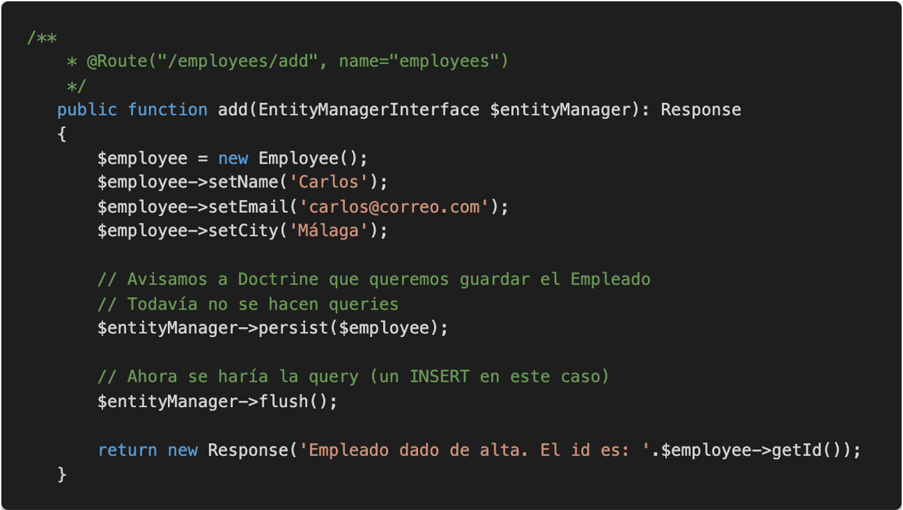
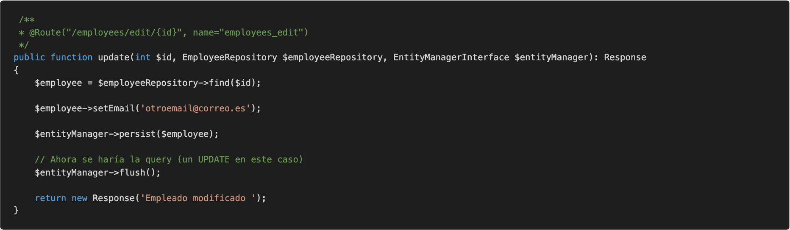
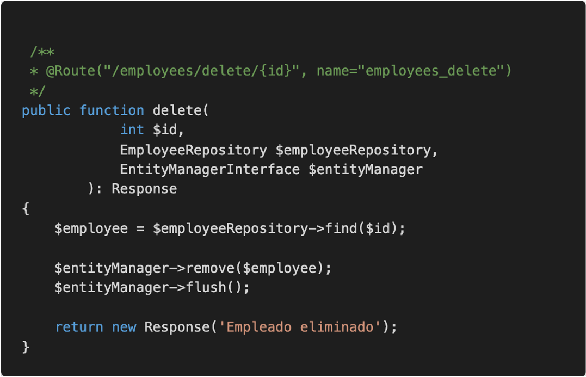

# Entity Manager

El Entity Manager se ocupa de mantener en sincronía las entidades con la base de datos.

Se ocupa por lo tanto de las tareas de insert, update y delete.

## Insert

## Update

## Delete

## Enlaces de interés

https://symfony.com/doc/current/doctrine.html
