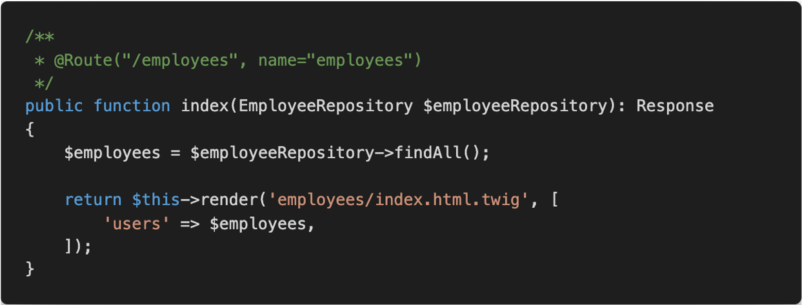
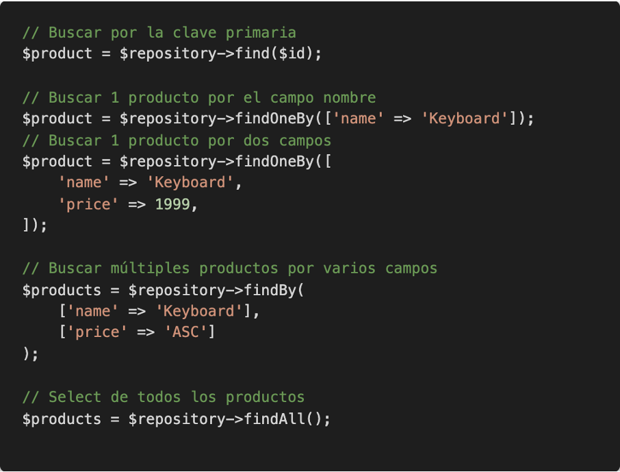

# Repositorios

## Select

Para realizar selects se utilizan los Repository. Hay un Repository asociado a cada Entity.



Algunos métodos de los objetos respository son:



## Ejemplos

```php
// look for a single Product by its primary key (usually "id")
$product = $repository->find($id);

// look for a single Product by name
$product = $repository->findOneBy(['name' => 'Keyboard']);
// or find by name and price
$product = $repository->findOneBy([
    'name' => 'Keyboard',
    'price' => 1999,
]);

// look for multiple Product objects matching the name, ordered by price
$products = $repository->findBy(
    ['name' => 'Keyboard'],
    ['price' => 'ASC']
);

// look for *all* Product objects
$products = $repository->findAll();
```

## Consultas con DQL

DQL es el lenguaje de consultas de Doctrine.

```php
/**
    * @return Product[]
    */
public function findAllGreaterThanPrice(int $price): array
{
    $entityManager = $this->getEntityManager();

    $query = $entityManager->createQuery(
        'SELECT p
        FROM App\Entity\Product p
        WHERE p.price > :price
        ORDER BY p.price ASC'
    )->setParameter('price', $price);

    // returns an array of Product objects
    return $query->getResult();
}
```

https://www.doctrine-project.org/projects/doctrine-orm/en/2.6/reference/dql-doctrine-query-language.html#doctrine-query-language

## Consultas con Query Builder

Query Builder permite ir modificando una consulta sobre la marcha.

```php
public function findAllGreaterThanPrice(int $price, bool $includeUnavailableProducts = false): array
{
    // automatically knows to select Products
    // the "p" is an alias you'll use in the rest of the query
    $qb = $this->createQueryBuilder('p')
        ->where('p.price > :price')
        ->setParameter('price', $price)
        ->orderBy('p.price', 'ASC');

    if (!$includeUnavailableProducts) {
        $qb->andWhere('p.available = TRUE');
    }

    $query = $qb->getQuery();

    return $query->execute();

    // to get just one result:
    // $product = $query->setMaxResults(1)->getOneOrNullResult();
}
```

https://www.doctrine-project.org/projects/doctrine-orm/en/2.6/reference/query-builder.html#the-querybuilder

## Consultas con SQL

```php
public function findAllGreaterThanPrice(int $price): array
{
    $conn = $this->getEntityManager()->getConnection();

    $sql = '
        SELECT * FROM product p
        WHERE p.price > :price
        ORDER BY p.price ASC
        ';
    $stmt = $conn->prepare($sql);
    $result = $stmt->executeQuery(['price' => $price]);

    // returns an array of arrays (i.e. a raw data set)
    return $result->fetchAllAssociative();
}
```


## Enlaces de interés

https://symfony.com/doc/current/doctrine.html
